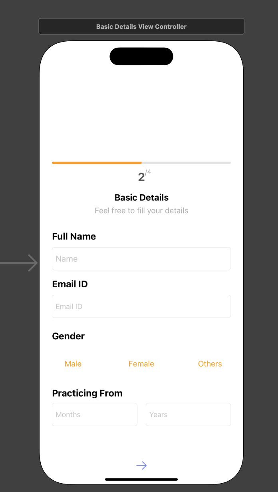
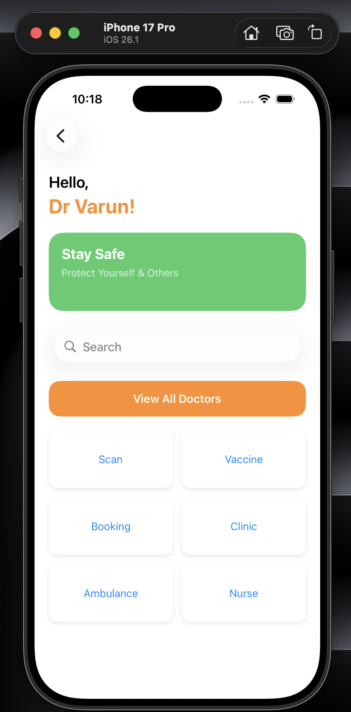
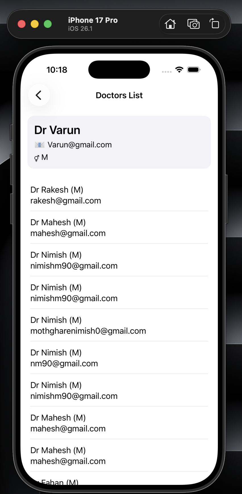

# 📱 Doctor Registration App

A clean and modern iOS healthcare application built using **Swift UIKit**, where doctors can register and view all registered doctors stored in a **SAP OData backend**.  
This project demonstrates real backend API integration, dynamic UI, and programmatic view layouts.

---

## ✨ Features

| Feature | Description |
|--------|-------------|
| Doctor Signup | Registers doctor with SAP OData API |
| Dashboard | Greets logged-in doctor with name and role |
| View All Doctors | Fetches and displays list from API |
| Highlight Current Doctor | Shows registered doctor first |
| Modern UI | Fully Programmatic UIKit design |

---

## 🚀 Tech Stack

| Technology | Usage |
|-----------|------|
| Swift 5 / UIKit | UI + Navigation |
| URLSession | Networking |
| SAP OData API | Backend database |
| iOS 17+ | Deployment target |
| Xcode 15+ | Development tool |

---

## 🔌 API Endpoints

| Action | Method | Endpoint |
|--------|:------:|----------|
| Register Doctor | POST | `ZCDS_C_TEST_REGISTER_NEW_CDS/ZCDS_C_TEST_REGISTER_NEW` |
| Get All Doctors | GET | `ZCDS_C_TEST_REGISTER_NEW_CDS/ZCDS_C_TEST_REGISTER_NEW` |
| Get Doctor by ID | GET | `ZCDS_C_TEST_REGISTER_NEW_CDS/ZCDS_C_TEST_REGISTER_NEW(guid'<ID>')` |

📌 Required Headers:
Content-Type: application/json
Accept: application/json
X-Requested-With: X

yaml
Copy code

Authorization: ❌ None

---

## 🖥 App Screens

### 📌 Basic Details Screen
Doctor registers personal information  


### 🏠 Dashboard Screen
Greets doctor + action menu  


### 📋 Doctors List Screen
Shows current doctor first, then others  


---

## ▶️ Run the App

```bash
git clone https://github.com/VarunKarthikB-18/Mobile-App-Dev-Task.git
open Mobile-App-Dev-Task.xcodeproj
✔ Choose Simulator (ex: iPhone 17 Pro)
✔ Press Run ▶
✔ Ensure backend API is reachable

👨‍⚕️ Developer
Varun Karthik Balaji
iOS App • Machine Learning • Web Development

📧 Email: bvarunkarthik05@gmail.com
🔗 GitHub Profile: https://github.com/VarunKarthikB-18

📄 License
This project is for academic and demonstration purposes only.
Unauthorised commercial use is not permitted.
